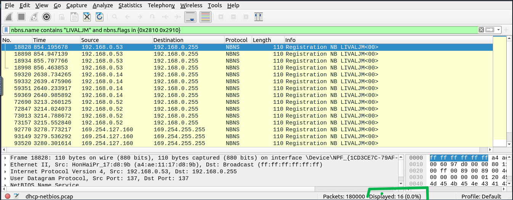
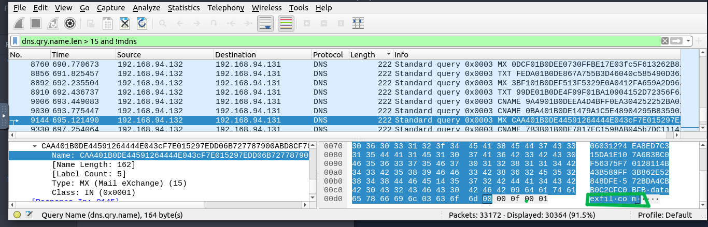

# SOC Traffic Analysis Lab – Wireshark Investigation

## 📌 Overview

This lab focused on identifying suspicious network activity across multiple PCAP files using **Wireshark**.  

Key objectives included:

- Detecting Nmap scans  
- Identifying ARP Poisoning / MITM attacks  
- Intercepting credentials  
- Host identification via DHCP, NetBIOS, and Kerberos  
- Detecting ICMP and DNS tunneling  

---

## 1️⃣ Nmap Scan Detection

### TCP Connect Scan
- Filter: `tcp.flags.syn==1 and tcp.flags.ack==0 and tcp.window_size > 1024`  
- Full TCP handshake observed → TCP Connect scan  
- Answer: 1000 TCP Connect scans  

### SYN Scan
- Filter: `tcp.flags.syn==1 and tcp.flags.ack==0 and tcp.window_size <= 1024`  
- Half-open scan, faster reconnaissance  

### UDP Scan
- Filter: `icmp.type==3 and icmp.code==3`  
- Closed UDP ports respond with ICMP Destination Unreachable  
- Answer: 1083 closed UDP ports  
- Open UDP port in range 55–70: port 68

---

## 2️⃣ ARP Poisoning & MITM Detection

- Attacker MAC: `00:0c:29:e2:18:b4`  
- ARP Requests Filter: `eth.src==00:0c:29:e2:18:b4 and arp.opcode==1` → 284 requests  
- HTTP Packets Filter: `eth.dst==00:0c:29:e2:18:b4 and http` → 90 packets  
- Sniffed Credentials Filter:  
```text
http.request.full_uri=="http://testphp.vulnweb.com/userinfo.php" 
and http.request.method==POST 
and urlencoded-form contains "uname"
```  
- 6 credentials captured, confirming MITM attack

---

## 3️⃣ Credential Interception

- Filter HTTP POST requests with `uname` fields  
- Multiple credentials intercepted → active credential harvesting

---

## 4️⃣ Host & User Identification

### DHCP
- Filter: `dhcp.option.hostname contains "Galaxy" and dhcp.option.hostname contains "A30"`  
- Host MAC: `9a:81:41:cb:96:6c`  

### NetBIOS
- Filter: `nbns.name contains "LIVALJM" and nbns.flags in {0x2810 0x2910}`  
- 16 registrations identified

### Kerberos
- Filter: `kerberos.CNameString=="<username>"`  
- Identified user IPs and service tickets  

---

## 5️⃣ Tunneling Detection

### ICMP Tunneling
- Large or repetitive payloads with encapsulated SSH data  

### DNS Tunneling
- Long subdomain queries, high-frequency requests → suspicious domain `dataexfil[.]com`

---

## 📷 Lab Screenshots

<p align="center">
  <br>
  <b>TCP Connect Scan Detection</b>
</p>

<p align="center">
  <br>
  <b>SYN Scan Detection</b>
</p>

<p align="center">
  <br>
  <b>UDP Scan Detection</b>
</p>

<p align="center">
  <br>
  <b>ARP Requests by Attacker</b>
</p>

<p align="center">
  <br>
  <b>MAC Address Column Verification</b>
</p>

<p align="center">
  <br>
  <b>Intercepted Credentials</b>
</p>

<p align="center">
  <br>
  <b>DHCP Host Identification</b>
</p>

<p align="center">
  <br>
  <b>NetBIOS Host Identification</b>
</p>

<p align="center">
  <br>
  <b>Kerberos User Activity</b>
</p>

<p align="center">
  <br>
  <b>ICMP Tunneling Detection</b>
</p>

<p align="center">
  <br>
  <b>DNS Tunneling Detection</b>
</p>

---

## 🔑 Key Skills Strengthened

- TCP flag analysis and protocol correlation  
- MAC/IP attribution  
- Credential traffic inspection  
- Detection of covert channels (ICMP/DNS tunneling)  
- Structured SOC investigation workflow  

---

## 📋 MITRE Techniques

| Activity | MITRE Technique |
|----------|----------------|
| Network Scanning | T1046 – Network Service Discovery |
| ARP Poisoning | T1557.002 – Adversary-in-the-Middle |
| Credential Interception | T1557 – Man-in-the-Middle |
| DNS Tunneling | T1071.004 – Application Layer Protocol: DNS |
| ICMP Tunneling | T1095 – Non-Application Layer Protocol |
| Credential Harvesting | T1056 – Input Capture |
